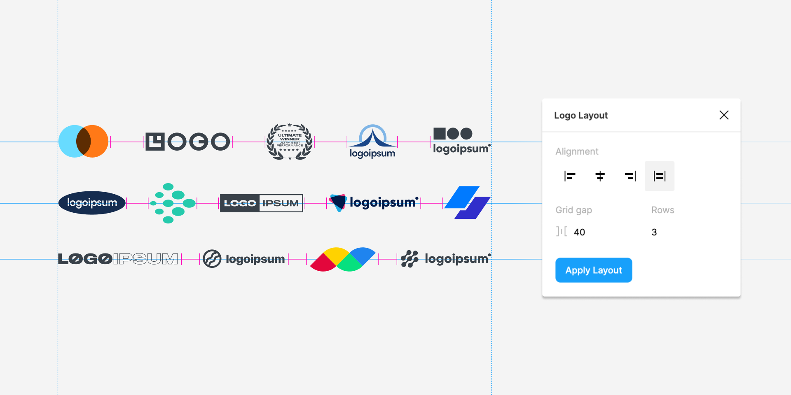

# Figma Logo Layout Plugin



Logo Layout optically scales and distributes logos in a grid. The algorithm takes into account the proportions of each logo so they all look great together in a grid — no matter how tall, wide, small, or large each logo may originally be. Create massive logo grids without wanting to quit design.

## Usage

- Install Logo Layout from the [Figma plugin library](https://www.figma.com/community)
- Select two or more objects
- Choose an alignment option
- Set a grid gap
- Choose the number of rows you'd like
- Click "Apply Layout" and sit back as Logo Layout does the rest
- Rearrange a few logos by hand if you'd prefer a different order. Run the plugin again to restore order and alignment.

## Development

Want to contribute to this plugin?

First clone this repository

```shell
git clone https://github.com/coryetzkorn/figma-logo-layout
cd figma-logo-layout
```

Install dependencies & build files

```shell
npm install
npm run build
```

_Tip:_ Instead of running the build command you can also use the VSCode command palette. Hit ⌘⇧B in Visual Studio Code, then select `tsc: watch - tsconfig.json`.

After building, open a project in Figma Desktop, select _Plugins -> Development -> New Plugin_. Click `Choose a manifest.json` and find the `manifest.json` file in this plugin directory.

Done! Now access via _Plugins -> Development -> Logo Layout_

## Author

Cory Etzkorn ([Twitter](https://twitter.com/coryetzkorn))
